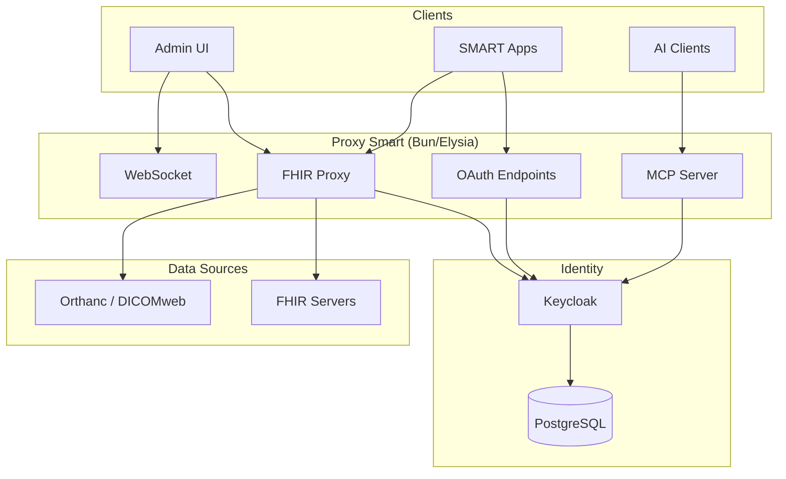

# Proxy Smart

<p align="center">
  <strong>A stateless proxy that adds OAuth 2.0 and SMART App Launch authorization to existing FHIR servers.</strong>
</p>

<!-- Version & Spec Badges -->
<p align="center">
  <a href="https://github.com/proxy-smart/proxy-smart/releases"></a>
  <a href="http://hl7.org/fhir/smart-app-launch/"></a>
  <a href="https://hl7.org/fhir/R4/"></a>
</p>

<!-- Compliance Badges -->
<p align="center">
  <a href="http://hl7.org/fhir/smart-app-launch/"></a>
  <a href="https://github.com/proxy-smart/proxy-smart/actions/workflows/smart-compliance-tests.yml"></a>
</p>

<!-- Tech Stack Badges -->
<p align="center">
  
  
  
  
  
  <a href="LICENSE-DUAL.md"></a>
</p>

<p align="center">
  <a href="#quick-start">Quick Start</a> •
  <a href="#features">Features</a> •
  <a href="#architecture">Architecture</a> •
  <a href="#documentation">Documentation</a> •
  <a href="https://discord.gg/FshSApM7">Discord</a>
</p>

---

## What is Proxy Smart?

Proxy Smart sits between your SMART apps and FHIR servers, handling authentication and authorization. It doesn't store any clinical data -- requests pass through to your existing FHIR servers, and the proxy manages OAuth flows and access control.

| You provide | Proxy Smart handles |
|---|---|
| A FHIR server (HAPI FHIR, Microsoft FHIR Server, AWS HealthLake, etc.) | SMART App Launch 2.2.0 flows |
| Keycloak (included in Docker setup) | OAuth 2.0 authorization & token management |
| Your SMART apps | Scope-based access control & FHIR proxying |

## Quick Start

**Requirements:** Node.js ≥18, Bun ≥1.0, Docker

```bash
# Clone the repository
git clone https://github.com/proxy-smart/proxy-smart.git
cd proxy-smart

# Install workspace dependencies
bun install

# Start the dev stack (Keycloak, PostgreSQL, Orthanc, backend container)
bun run docker:dev

# Or run the backend locally against that stack
bun run dev
```

Then open:

| Service | URL |
|---|---|
| Backend API | http://localhost:8445 |
| Admin UI | http://localhost:8445/webapp/ |
| Keycloak | http://localhost:8080 |
| Orthanc (DICOMweb) | http://localhost:8042 |

The dev stack talks to public test FHIR servers (`hapi.fhir.org`, `server.fire.ly`) until you register your own in the admin UI. The admin UI itself is built in its own repository and copied into `webapp-dist/` by CI, so a local build serves an explanatory page at `/webapp` instead of the dashboard.

## Features

### 🔐 Stateless FHIR Proxy

No clinical data in the proxy means a smaller attack surface, simpler compliance (HIPAA, GDPR), easy horizontal scaling, and less infrastructure to manage. Audit logging for access patterns and OAuth flows is available when needed.

### 🏥 SMART App Launch 2.2.0

Full implementation of the [SMART App Launch](http://hl7.org/fhir/smart-app-launch/) specification -- apps that follow the standard work out of the box. OAuth 2.0 with PKCE, JWT validation, scope-based access control, refresh token rotation, and enterprise SSO via SAML 2.0 and OIDC.

### 🖥️ Admin Dashboard

Built-in React admin UI for managing SMART apps, FHIR server connections, users, and scopes -- no manual config editing required.

### 🐳 Docker-Ready

One-command development and production deployments with Docker Compose, including mono-container and multi-container options.

## Architecture

```
SMART App → Proxy Smart → FHIR Server
                ↓
            Keycloak (OAuth)
```



### Workspaces

| Workspace | Description |
|---|---|
| `backend/` | Elysia API server, FHIR proxy, OAuth endpoints, MCP server |
| `packages/auth/` | SMART authorization layer -- launch context, scope narrowing, token enrichment (internal, unpublished) |
| `packages/api-client/` | API client generated from the backend's OpenAPI spec |
| `packages/cli/` | `proxy-smart` admin CLI |
| `packages/app-store/` | App catalog visibility and publication state |
| `packages/elysia-mcp/` | Derives MCP tools and resources from Elysia routes |
| `packages/patient-picker/` | Patient selection UI for standalone SMART launch |
| `config/eslint/` | Shared ESLint configuration |
| `deploy/<env>/` | Per-environment Keycloak realm and app store config |
| `testing/` | Inferno compliance suites (`alpha`, `beta`, `production`) and Playwright e2e |

The admin dashboard lives in its own repository (`proxy-smart/proxy-smart-admin-ui`); CI builds it into `webapp-dist/`, which the backend serves at `/webapp`. Package boundaries and what is published are covered in [docs/packages.md](docs/packages.md).

### Tech Stack

| Layer | Technologies |
|---|---|
| **Backend** | Bun, Elysia, TypeScript |
| **Frontend** | React 19, Vite, Tailwind CSS |
| **Identity** | Keycloak + PostgreSQL |
| **Testing** | `bun test`, Playwright, Inferno |
| **Infra** | Docker Compose, Caddy |

> PostgreSQL only stores user/config data. Clinical data stays on your FHIR servers.

## Access Control Pipeline

Every FHIR proxy request runs through a layered security pipeline:

```
Request → JWT Validation → Consent + IAL → SMART Scopes → Role-Based Filtering → FHIR Server
```

| Step | What it does | Default |
|---|---|---|
| **JWT Validation** | Verifies token signature, expiry, and issuer | Always active |
| **Consent + IAL** | Enforces patient consent policies and identity assurance level | Configurable |
| **SMART Scope Enforcement** | Checks the token's `scope` claim permits the requested resource type and operation (e.g., `patient/Observation.read` → allow GET on Observation). Supports SMART v1 and v2 scope syntax. | **Enforced** |
| **Role-Based Filtering** | Narrows which data is returned based on `fhirUser` identity -- Patients only see their own data, Practitioners only see assigned patients. | **Audit-only** |

Scope enforcement and role-based filtering are each configurable to `enforce` (blocks with HTTP 403), `audit-only` (logs the violation and lets the request through), or `disabled`. The variables that set them, with every other setting the backend reads, are in [Environment Variables](docs/environment-variables.md).

## Scalability

Proxy Smart inherits Keycloak's proven horizontal scalability. The proxy layer is stateless -- it adds no bottleneck on top of Keycloak's auth flows.

### Official Keycloak Benchmarks ([source](https://www.keycloak.org/high-availability/single-cluster/introduction))

| Metric | Regularly Tested | Max Tested |
|---|---|---|
| **Users** | 1,000,000 | 30,000,000 |
| **Password logins/sec** | 300 | 1,000 |
| **Token refreshes/sec** | -- | 20,000 |
| **Client credential grants/sec** | -- | 2,000 |

### CPU Sizing ([source](https://www.keycloak.org/high-availability/multi-cluster/concepts-memory-and-cpu-sizing))

| Operation | vCPU per unit |
|---|---|
| 15 password logins/sec | 1 vCPU |
| 120 client credential grants/sec | 1 vCPU |
| 120 refresh token requests/sec | 1 vCPU |

Base memory per Keycloak pod: **1,250 MB** (includes caches for 10,000 sessions).

### Max Tested Setup

6 Pods across 3 AWS availability zones, each with 40 vCPU / 8 GB RAM, backed by Aurora PostgreSQL multi-AZ -- achieving **1,000 logins + 20,000 token refreshes per second**. CPU usage scales linearly with request count.

## Documentation

<table>
<tr>
<td width="50%" valign="top">

### Getting Started
- [Documentation index](docs/index.md) -- every page, grouped
- [Deployment](docs/deployment.md)
- [Environment Variables](docs/environment-variables.md)
- [Packages](docs/packages.md)

### Core
- [FHIR Proxy](docs/fhir-proxy.md)
- [OAuth & Authentication](docs/oauth-authentication.md)
- [DICOMweb Proxy](docs/dicomweb-proxy.md)

</td>
<td width="50%" valign="top">

### Admin UI
- [Dashboard](docs/admin-ui/dashboard.md) and the rest of the [admin guides](docs/index.md)

### SMART on FHIR
- [SMART 2.2.0 Implementation Status](docs/SMART_2.2.0_CHECKLIST.md)
- [Compliance Reports](docs/compliance-reports.md)

### AI & MCP
- [MCP HTTP Server](docs/MCP_HTTP_SERVER.md)
- [Backend API Tools](docs/BACKEND_API_TOOLS.md)
- [Claude Code / Codex plugin](https://github.com/proxy-smart/plugins/blob/main/proxy/README.md)
- [Plugin for the public beta](https://github.com/proxy-smart/plugins/blob/main/proxy-beta/README.md)

### Technical
- [Version Management](docs/tutorials/version-management.md)

</td>
</tr>
</table>

## Docker

```bash
# Development (Keycloak, PostgreSQL, Orthanc, backend)
bun run docker:dev
# → http://localhost:8445/webapp/

# Production (separate containers)
bun run docker:prod
# → Backend: http://localhost:8445
# → Keycloak: http://localhost:8080
```

<details>
<summary>All Docker commands</summary>

| Command | Description |
|---|---|
| `bun run docker:dev` | Start dev containers |
| `bun run docker:dev:build` | Build and start |
| `bun run docker:dev:down` | Stop |
| `bun run docker:dev:logs` | View logs |
| `bun run docker:prod` | Start prod containers |
| `bun run docker:prod:build` | Build and start |
| `bun run docker:prod:down` | Stop |
| `bun run docker:prod:logs` | View logs |
| `bun run docker:backend` | Build the backend image |
| `bun run docker:mono` | Build the mono-container image |
| `bun run docker:up` / `docker:down` / `docker:logs` | Base stack (Keycloak + PostgreSQL) |
| `bun run keycloak:start` / `keycloak:stop` | Keycloak only |

</details>

## Roadmap

**Current**: `0.4.x` -- see [Releases](https://github.com/proxy-smart/proxy-smart/releases) for the version on each channel.

PKCE, v1 and v2 scope syntax, token introspection, backend services authorization and user-access brands are in; the Inferno SMART App Launch suite runs in CI against every release channel. What remains before `v1.0.0` is hardening rather than protocol work: performance, penetration testing, and certification readiness.

See the [implementation checklist](docs/SMART_2.2.0_CHECKLIST.md) for the per-requirement status.

## Branching Strategy

| Branch | Purpose |
|---|---|
| `main` | Production releases (auto-tagged) |
| `test` | Beta releases (`-beta` suffix) |
| `develop` | Alpha releases (`-alpha` suffix) |
| `dev/*` | Feature branches (no PR required) |

## Contributing

1. Fork the repo
2. Create a branch (`dev/your-feature`)
3. Make changes with tests
4. Submit PR

See [CONTRIBUTING.md](CONTRIBUTING.md) for guidelines.

## License

Dual licensed:

- **AGPL v3** -- open source / non-commercial use
- **Commercial license** -- available for proprietary use

See [LICENSE-DUAL.md](LICENSE-DUAL.md) for details.

## Support

- 💬 [Discord](https://discord.gg/FshSApM7)
- 📖 [Documentation](docs/)
- 🐛 [GitHub Issues](https://github.com/proxy-smart/proxy-smart/issues)

---

<p align="center">
  <a href="http://hl7.org/fhir/smart-app-launch/">SMART App Launch</a> •
  <a href="https://hl7.org/fhir/R4/">FHIR R4</a> •
  <a href="https://www.keycloak.org/">Keycloak</a>
</p>
